# eCommerce Website

## Project Overview

This project simulates a streaming data pipeline for a fictional eCommerce website. It generates fake data and publishes it into Apache Kafka topics. Apache Spark then consumes, processes, and analyzes the streaming data before loading it into a MongoDB database.  

## Tools and Languages

- **Tools**: Docker Compose, Apache Airflow, Apache Kafka, Apache Spark, MongoDB
- **Languages**: Python and MongoDB Query Language (MQL)

## Key Tasks

1. **Streaming Data Generation and Publishing**
    - Created fake datasets for customers, products, transactions, product views, and user interactions using Python's Faker library. 
    - Published the generated data to their respective Kafka topics in batch mode. 

2. **Workflow Management**
    - Automated data generation and publishing using Airflow.

3. **Streaming Data Consumption**
    - Used Spark Structured Streaming to process and analyze the data. 

4. **Streaming Data Storing**
    - Persisted processed data into a MongoDB database for further usage and visualization.

5. **Containerization**
    - Containerized the project with Docker Compose for easy deployment in a production environment. 

## Running The Project

### Prerequisites

Ensure the following are installed:
- Docker and Docker Compose
- Python 3.x

### Installation and Setup

1. **Clone the Repository** 

    ```sh
    git clone https://github.com/HuyNgo171099/eCommerce-Website

2. **Navigate to the Project Directory**

    ```sh
    cd eCommerce-Website

3. **Start Kafka and Airflow Services**

    ```sd
    docker-compose up --build -d zookeeper kafka1 kafka2 kafka-ui db airflow-init airflow-webserver airflow-scheduler

4. **Access Airflow GUI**: Navigate to `localhost:8080` in your browser and run the DAG. 

5. **Access Kafka GUI**: Navigate to `localhost:8085` in your browser.

6. **Start MongoDB and Spark Services**

    ```sh
    docker-compose up --build -d mongodb spark-master spark-worker

7. **Access Spark Master GUI**: Navigate to `localhost:8081` in your browser.

8. **Access Spark Worker GUI**: Navigate to `localhost:8082` in your browser.

9. **Submit Spark Job**

    ```sh
    docker cp ./stream_processing/process_stream.py spark-master:/process_stream.py
    docker cp ./stream_processing/requirements.txt spark-master:/requirements.txt
    docker exec -it spark-master pip install -r /requirements.txt
    docker exec -it spark-master spark-submit --packages org.apache.spark:spark-sql-kafka-0-10_2.12:3.1.2,org.mongodb.spark:mongo-spark-connector_2.12:10.4.0 /process_stream.py

10. **Access MongoDB**

    ```sh
    docker exec -it mongodb mongosh -u <your_user_name> -p <your_password> --authenticationDatabase admin

## Streaming Data Generation with Faker

- **Customer Data**: Each customer has the following data fields: `customer_id`, `name`, `email`, `location` (living address), `age`, `gender`, `account_created` (when a customer creates an account on the website), and `last_login` (when a customer last login to the website). 
- **Product Data**: Each product has the following data fields: `product_id`, `name`, `category`, `price`, `stock_quantity`, `supplier`, and `rating`.
- **Transaction**: Each transaction has the following data fields: `transaction_id`, `customer_id`, `product_id`, `quantity`, `date_time` (when the online purchase happens), `status` (three available categories: completed, pending, or cancelled), and `payment_method` (three available methods: credit card, PayPal, and bank transfer).
- **Product View Data**: The time a customer spends viewing a product. Each view has the following data fields: `view_id`, `customer_id`, `product_id`, `timestamp` (when the view happens), and `view_duration` (the duration of the view, in milliseconds).  
- **User Interaction Data**: Each interaction has the following data fields: `interaction_id`, `customer_id`, `product_id`, `timestamp` (when the interaction happens), `interaction_type` (three available types: wishlist_addition, review, and rating), and `details` (if the `interaction_type` is review, this field generates a fake review sentence).     

## Streaming Data Publishing with Apache Kafka

(This section explains the last function in the script `generate_data.py`)

- **Producer Creation**: The function `KafkaProducer` was used to create a producer. This producer was connected to the two Kafka brokers (to which the streaming data would later be sent). The first Kafka broker was running on the internal port `29092` and the second Kafka broker was running on the internal port `29094`. Generally speaking, these ports serve as the address that would allow any Kafka client to locate and connect to Kafka. Moreover, `max_block_ms` was set to 5000. This parameter sets the maximum amount of time (in miliseconds) that a producer will block while trying to send a message to Kafka. In this case, if the producer could not connect to Kafka within five seconds, it would timeout, helping prevent the producer from hanging indefinitely in case of connectivity issues. 
- **Kafka Topics**: Some Kafka topics were created: `customers`, `products`, `transactions`, `product_views`, `system_logs`, and `user_interactions`. The streaming data were generated and published into these topics in batch mode. The `batch_size` was set to 100. This means that every time the function `stream_data` is called (another way of saying this is every time the DAG is run), it would generate and send 100 messages and then exit. The DAG is scheduled to run once per day in Airflow so in other words, every day, 100 fake messages will be created and send to the Kafka topics.      

## Streaming Data Analysis with Apache Spark

(This section explains some functions in the script `process_stream.py`)

- **Spark Session**: To connect the Spark session to Kafka and MongoDB, the Spark-Kafka connector (`org.apache.spark:spark-sql-kafka-0-10_2.12:3.1.2`) and the MongoDB-Spark connector (`org.mongodb.spark:mongo-spark-connector_2.12:10.4.0`) were downloaded. 

- **Streaming Data Transformation**: The streaming data from each Kafka topic were transformed using their respective `kafka_*_streams` function. That is, the function `kafka_customer_streams` was used to transform the streaming data from the `customers` topic, the function `kafka_product_streams` was used to transform the streaming data from the `products` topic, and so on. The function `kafka_customer_streams`:
    - Created a schema which would later be used to format each of the column in the customerDF Spark DataFrame. 
    - Established a connection to the two Kafka brokers (`.option("kafka.bootstrap.servers", kafka_bootstrap_servers)`) and read the streaming data from the `customers` topic (`.option("subscribe", "customers")`). 
    - Read the streaming data from the beginning (`.option("startingOffsets", "earliest")`). 
    - Loaded and converted each message into a string (`.selectExpr("CAST(value AS STRING)")`). This string would then be parsed into a JSON object and converted into the structured format that was defined by the schema (`.select(from_json("value", customerSchema).alias("data"))`). 
    - Expanded all the fields in the JSON object into individual columns (`.select("data.*")`). 
    - Added a watermark based on the `last_login` timestamp to manage event-time processing and late data (`.withWatermark("last_login", "2 hours")`). 
    - All of the other `kafka_*_streams` functions worked in a similar way. 

- **Streaming Data Analysis**: The first image below displays the output of the function `analyze_customer_data` (More specifically, the function returned a Spark DataFrame called customerAnalysisDF which was loaded into the collection customer_analysis in the ecommerce_website MongoDB database. The image displays the first few documents of the collection). The components of this function include:
    - `window(col("last_login"), "1 day"`: Created 1-day windows based on the `last_login` timestamp. From the image, it can be seen that the window of the first document starts at `'2024-11-02 00:00:00'` and ends at `'2024-03-11 00:00:00'`, which represents the date November 2nd, 2024. 
    - `groupBy(window(col("last_login"), "1 day"), "gender")`: grouped the streaming data by the unique combinations of the date windows and gender (three available categories: male, female, and other). Thus, for example, if there were five date windows, there would be 15 groups. 
    - `.agg(count("customer_id").alias("total_customers"), max("last_login").alias("last_activity"))`: within each group, counted the total number of customers and found the most recent `last_login` timestamp.
    - `.withWatermark("last_login", "2 hours")`: set a threshold of 2 hours, meaning that within each group, Spark would ignore any messages whose `last_login` value was more than 2 hours older than the message whose `last_login` value was the most recent within that group.
    - All the other `analyze_*_data` functions worked in a similar way. 
    - In this project, managing event-time processing and late data using `withWatermark` was done in a nuanced way for testing purposes. 

<table>
  <tr>
    <td>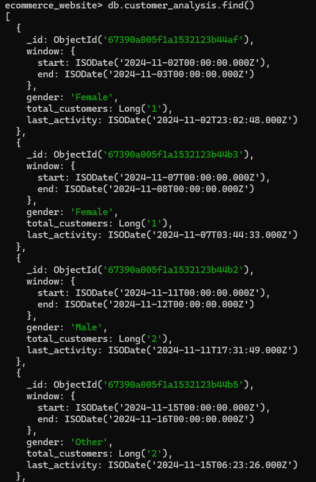</td>
    <td>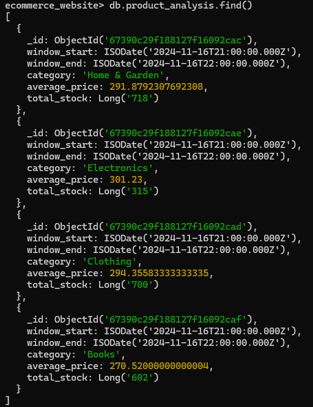</td>
  </tr>
  <tr>
    <td>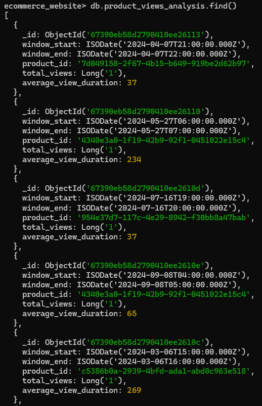</td>
    <td>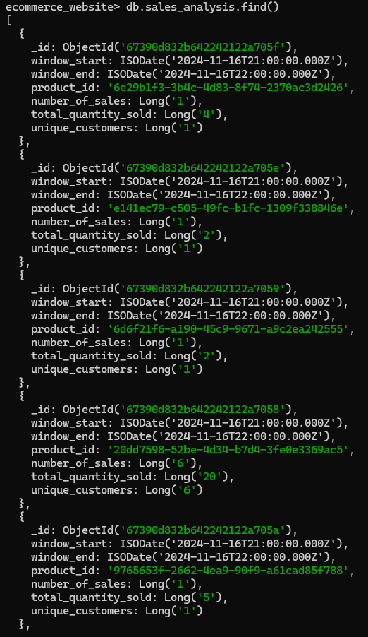</td>
  </tr>
</table>

## MongoDB

The processed Spark DataFrames were stored in a MongoDB database called `ecommerce_website`. This database has four collections `customer_analysis`, `product_analysis`, `sales_analysis`, and `product_views_analysis`. To verify that all the Spark DataFrames were successfully loaded into their respective collection, run the following commands.

1. Open a new terminal, navigate to the project directory, and run the command `docker exec -it mongodb mongosh -u <your_user_name> -p <your_password> --authenticationDatabase admin`
2. Run the command `show dbs` to display all the available databases.
3. Run the command `use ecommerce_website` to access the ecommerce_website database.
4. Run the command `show collections` to display all the available collections in the ecommerce_website database. 
5. Run the command `db.<name_of_the_collection>.countDocuments()` to count the total number of documents a collection has. 
6. Run the command `db.<name_of_the_collection>.find()` to list all of the documents inside a collection.  

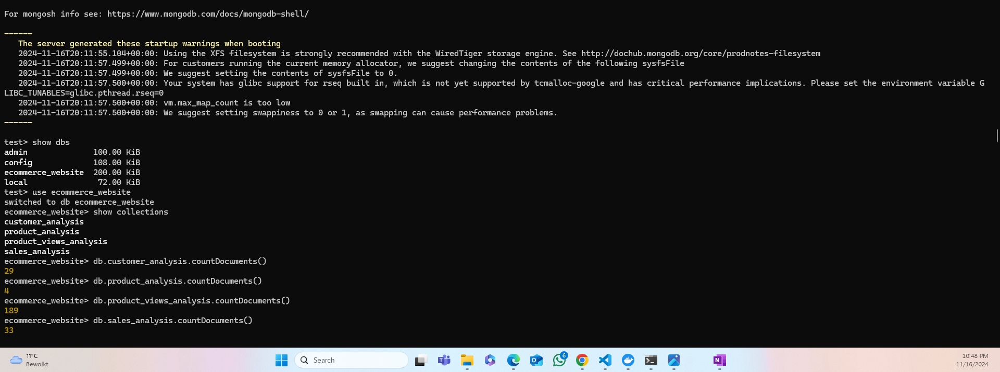

## Monitoring the DAG with Apache Airflow

After executing the DAG with Airflow, I verified successful task completion via the Airflow webserver GUI. By mapping Docker’s internal port 8080 to my local port 8080, I accessed the GUI at `localhost:8080` in my browser.

- **DAG Overview**:  Airflow uses Directed Acyclic Graphs (DAGs) to collect tasks, organize them with dependencies and relationships to specify how they should run. The image below depicts the DAG of this project. The green border lines indicate that the task is executed successfully.

    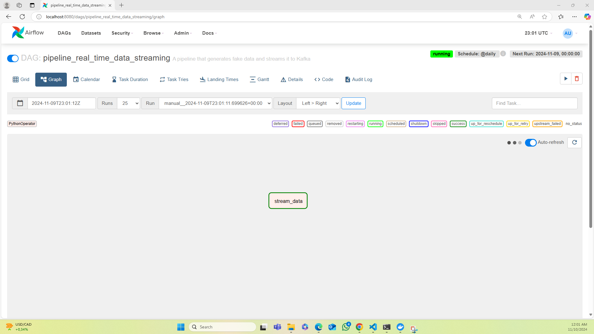

- **Task Logs**: While green border lines on the Airflow webserver GUI indicate successful task completion, it is important to check task logs to verify success, especially if try-except blocks are used in the script. The task log provides precise success or error information. The image below displays the task log, which shows a successful run with no errors, confirming that the DAG executes smoothly.

    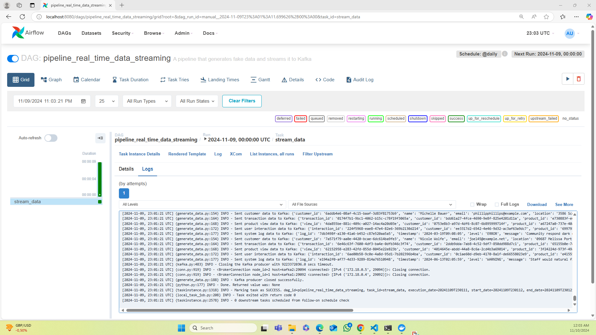

## Examining Apache Kafka Topics with Provectus GUI

The image below displays the basic information of the two Kafka brokers.  

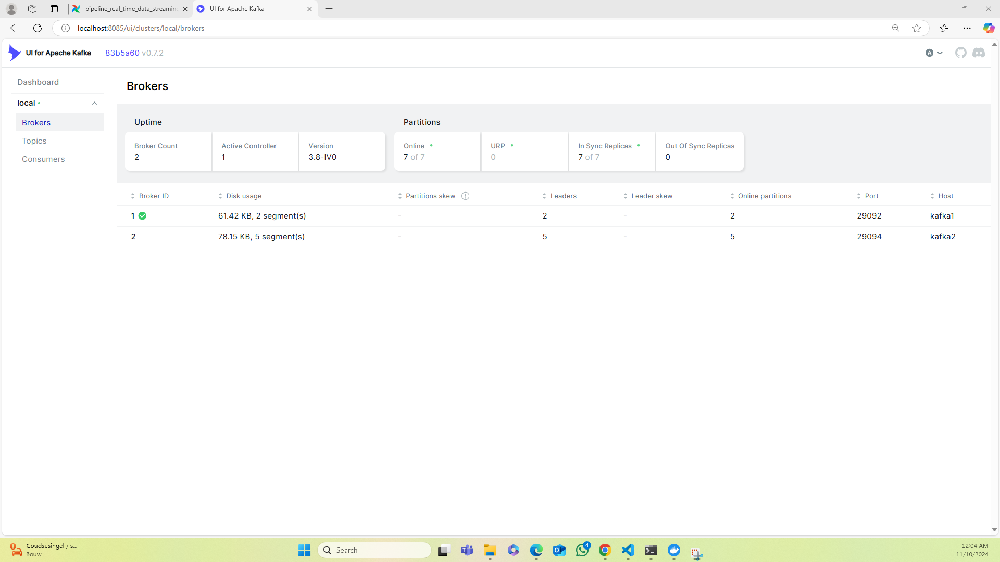

The image below displays the basic information of the Kafka topics. Because this project was mainly for development purposes, each topic only had one partition and one replication factor. This means that each topic was stored in only one broker and had no replications. If, for example, the number of partitions was set to two and the number of replication factor was set to three, each of the topic would be divided into two parts, each parts would be stored in each of the two brokers, and each part would also be replicated three times. 

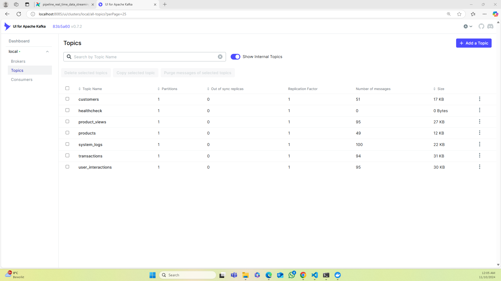

The images below display how the messages are stored in the Kafka topics. 

<table>
  <tr>
    <td>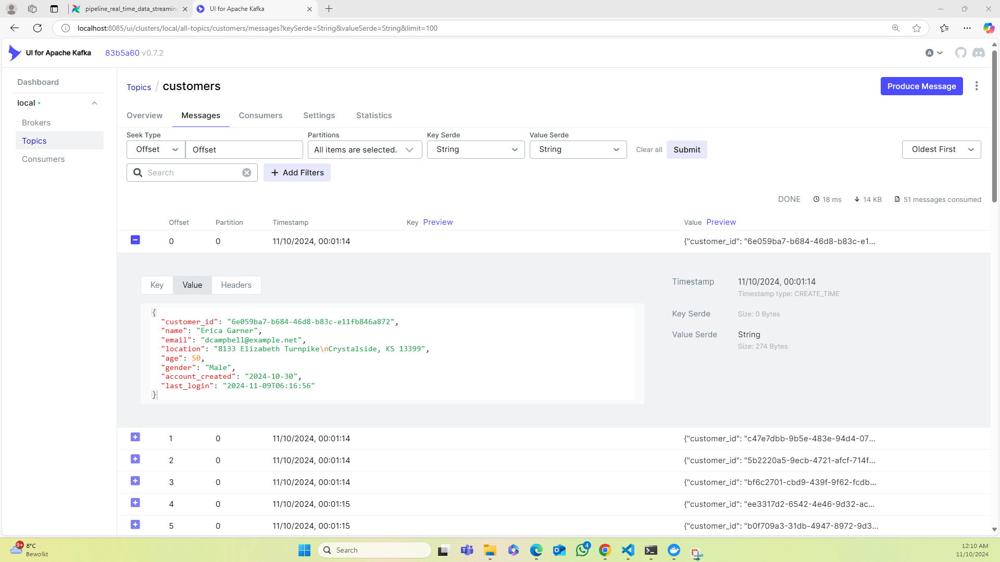</td>
    <td>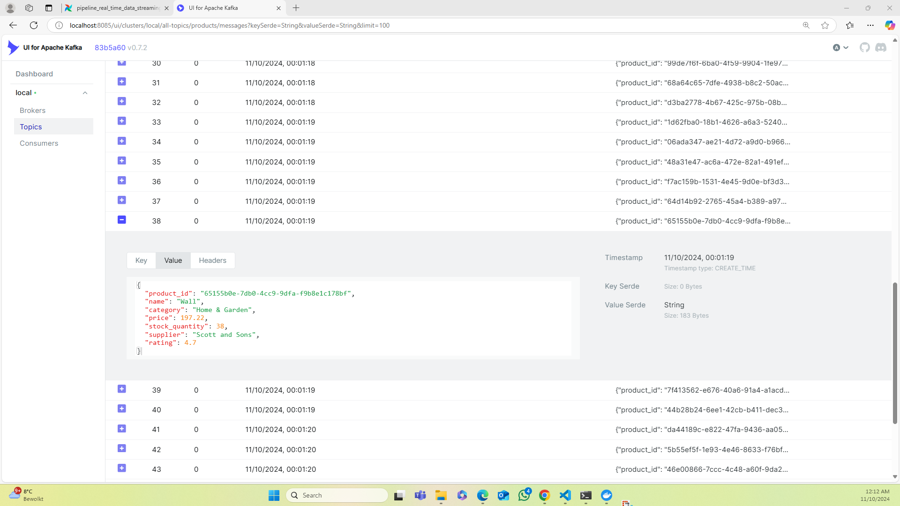</td>
  </tr>
  <tr>
    <td>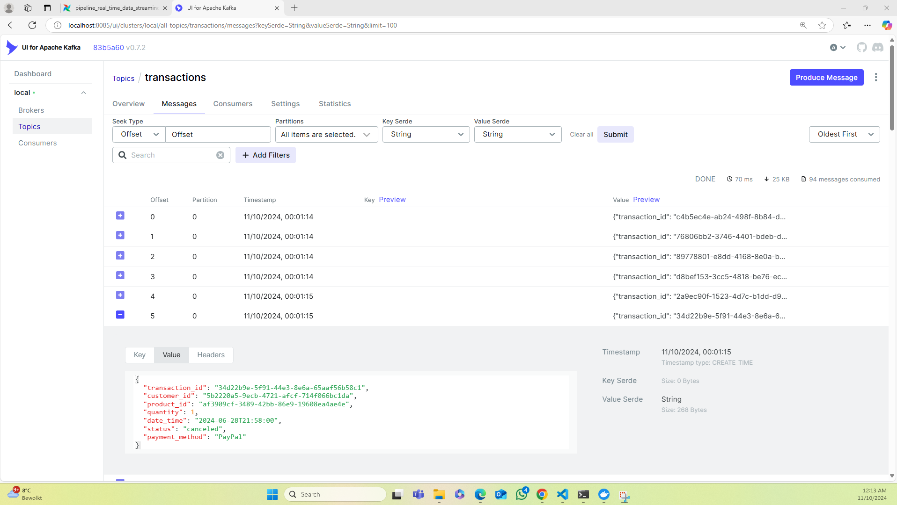</td>
    <td>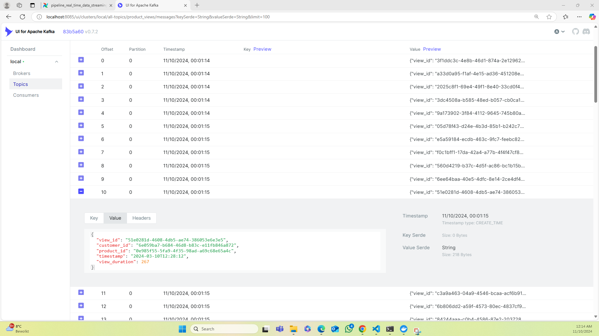</td>
  </tr>
</table>

## Checking Apache Spark Master Node and Worker Node with Bitnami GUI

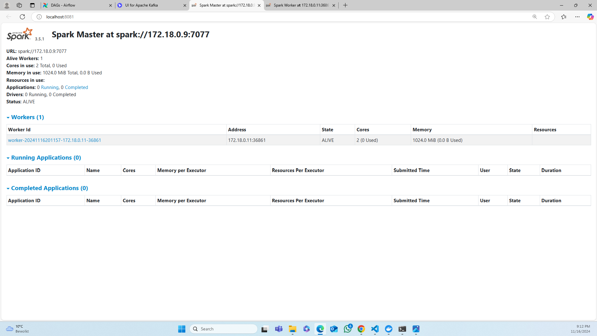
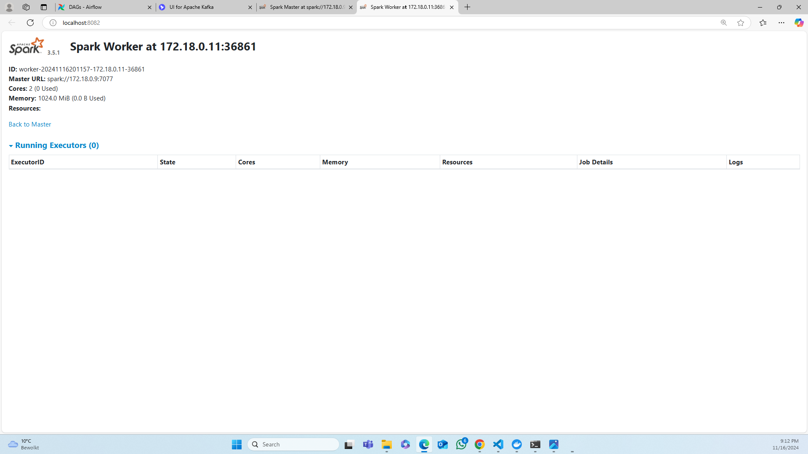

## Future Improvements

To enhance the depth and functionality of this project, here are some improvements I plan to explore in the future:

- **Real-Time Dashboards**: It would be ideal to connect MongoDB to a visualization tool like Tableau or Grafana to create interactive dashboards which could be used to monitor changes in the key performance metrics. 
- **Cloud Integration**: It would be better to migrate the entire pipeline to managed cloud services such as Microsoft Azure for better performance and reliability. 
